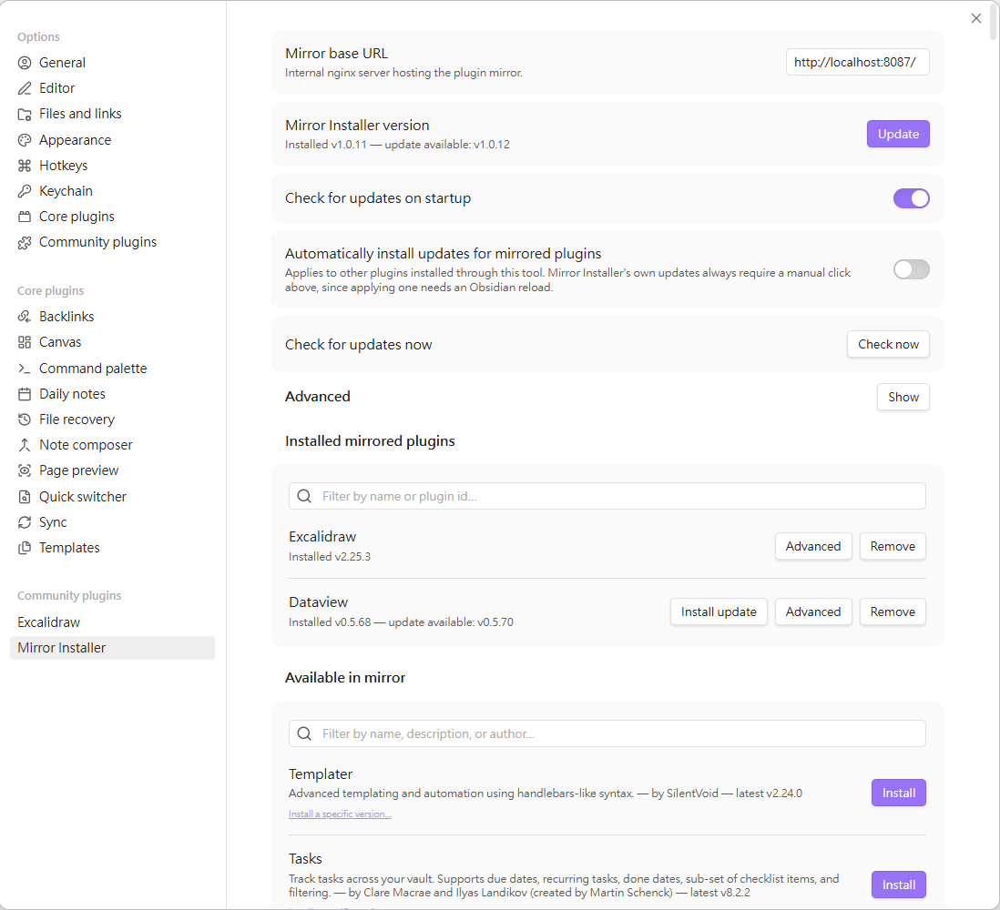

# Obsidian 外掛安裝助手（Mirror Installer）使用說明

## 這是什麼？

**Mirror Installer** 是一個 Obsidian 外掛，讓你可以在公司內部網路直接瀏覽、安裝、更新一整批社群外掛，不需要連到 GitHub。

平常我們安裝 Obsidian 社群外掛，或是想搶先體驗還沒上架官方商店的外掛（通常會用 [BRAT](https://github.com/TfTHacker/obsidian42-brat) 這個工具），都需要連到 GitHub 才能下載。但公司內部網路不一定能連上 GitHub，這時候就裝不了。

我們的解法是：**先在公司內部架一台「外掛鏡像伺服器」，把常用的外掛都預先準備好**，然後透過這個 Mirror Installer 外掛，直接向內部伺服器瀏覽、安裝、更新，全程不需要 GitHub。

目前鏡像已經涵蓋 **207 個熱門社群外掛**（依下載量排名的前 200 名），完整清單在文件最下方。

## 安裝步驟（只需要做一次）

1. 跟我索取安裝套件包（包含 `manifest.json`、`main.js`、`data.json` 三個檔案）。
2. 在你的 Obsidian 保管庫（vault）中，建立資料夾：
   ```
   <你的保管庫>/.obsidian/plugins/obsidian-mirror-installer/
   ```
3. 把三個檔案複製進去這個資料夾。
4. 回到 Obsidian，進入 **設定 → 第三方外掛（Community plugins）**，重新整理一下外掛清單，找到 **Mirror Installer**，把它啟用。

> 💡 **鏡像伺服器網址不用自己填。** 我提供的 `data.json` 已經把內部鏡像伺服器的網址預先寫好了，啟用外掛後就可以直接使用。
>
> 如果你是自己另外設定的（例如 `data.json` 沒有帶到），才需要手動填入：進入外掛的設定頁籤，把 **Mirror base URL** 欄位填成內部鏡像伺服器的網址（跟我要正確網址）。

以上步驟**只需要做一次**。之後不管是這個外掛本身，還是透過它裝的其他外掛，都可以直接在 Obsidian 裡面更新，不用再重複複製檔案的步驟。

## 安裝完成後可以做什麼？

打開 **設定 → Mirror Installer**，你會看到：



- **Available in mirror（鏡像上可用的外掛）**：可以用名稱、描述、作者搜尋，找到想要的外掛後按一下 **Install** 就裝好了。
- **Installed mirrored plugins（已安裝的鏡像外掛）**：列出你已經透過這個工具安裝的外掛，有更新的話會出現 **Install update** 按鈕，一鍵更新。也可以在這裡移除外掛，或透過 **Advanced** 按鈕開啟預發布（beta）版本的接收。
- **Mirror Installer version（本外掛版本）**：這個外掛本身有新版本時，一樣會在這裡顯示，按 **Update** 下載，下載完成後會出現 **Reload Obsidian** 按鈕，按下去就完成套用了。

也就是說，之後不管是要裝新外掛、更新舊外掛，還是更新 Mirror Installer 自己，全部都在這一個設定頁籤裡完成。

## 目前涵蓋的外掛清單（共 207 個）

以下是目前鏡像伺服器上已經準備好、可以直接安裝的外掛（依名稱排序）：

| 外掛名稱 | 說明 | 作者 |
|---|---|---|
| Actions URI | Adds additional `x-callback-url` endpoints to the app for common actions — it's a clean, super-charged addition to Obsidian URI. | Carlo Zottmann |
| Admonition | Create and customize callout blocks — tips, warnings, notes, and more — with custom icons and styles. | Jeremy Valentine, continued by Erin Schnabel |
| Advanced Canvas | Supercharge your canvas experience! Create presentations, flowcharts and more! | Developer-Mike |
| Advanced Slides | Create markdown-based presentations in Obsidian | Matthäus Szturc |
| Advanced Tables | Improved table navigation, formatting, manipulation, and formulas. | Tony Grosinger |
| Advanced URI | Advanced modes for Obsidian URI | Vinzent |
| Agent Client | Chat with AI agents via the Agent Client Protocol directly from your vault. | RAIT-09 |
| AidenLx's Folder Note | Add description, summary and more info to folders with folder notes. | AidenLx |
| Annotator | This is a sample plugin for Obsidian. It allows you to open and annotate PDF and EPUB files. | Obsidian |
| Another Quick Switcher | This is an Obsidian plugin which is another choice of Quick switcher. | tadashi-aikawa |
| Auto Link Title | This plugin automatically fetches the titles of links from the web | Matt Furden |
| Auto Note Mover | Auto Note Mover will automatically move the active notes to their respective folders according to the rules. | faru |
| Automatic Table Of Contents | Create a table of contents in a note, that updates itself when the note changes | Johan Satgé |
| Banners | Add banner images to your notes! | Danny Hernandez |
| Better Export PDF | Export your notes to PDF, support export preview, add bookmarks outline and header/footer. | l1xnan |
| Better Word Count | Counts the words of selected text in the editor. | Luke Leppan |
| Book Search | Helps you find books and create notes. | anpigon |
| BRAT | Easily install plugin beta versions for testing. | TfTHacker |
| Breadcrumbs | Add structured hierarchies to your notes. | MichaelPPorter |
| Buttons | Create Buttons in your Obsidian notes to run commands, open links, and insert templates | shabegom |
| Calendar (Beta) | Calendar view of your daily notes | Liam Cain |
| Calendar Bases | Adds a calendar layout to bases so you can display notes with dates in an interactive calendar view. | Edrick Leong |
| Calendarium | Craft mind-bending fantasy and sci-fi calendars. | Jeremy Valentine |
| Callout Manager | Easily create and customize callouts. | eth-p |
| Canvas Mindmap | A plugin to make your canvas work like a mindmap. | Boninall |
| CardBoard | Display markdown tasks on kanban style boards. | roovo |
| Charts | This Plugin lets you create Charts within Obsidian | phibr0 |
| Charts View | Data visualization solution in Obsidian based on Ant Design Charts. | caronchen |
| ChatGPT MD | Chat with cloud and local AI providers directly in Obsidian notes. | Deniz Okcu (created by Bram Adams) |
| Checklist | Combines checklists across pages into users sidebar | delashum |
| Citations | Automatically search and insert citations from a Zotero library | Jon Gauthier |
| Claudian | Embeds Claude Code, Codex, and other coding agents as AI collaborators in your vault. Your vault becomes their working directory, giving them capabilities for file reads and writes, search, bash commands, and multi-step workflows. | Yishen Tu |
| Clear Unused Images | Clear the images that you are not using anymore in your markdown notes to save space. | Ozan |
| cMenu | cMenu is a plugin that adds a minimal text editor modal for a smoother writing/editing experience ✍🏽. | chetachi |
| Code Styler | Style and customize codeblocks and inline code in both editing mode and reading mode. | Mayuran Visakan |
| Colored Tags | Colorizes tags in different colors. Colors of nested tags are mixed with the root tag to improve readability. Text color contrast is automatically matched to comply with AA level of WCAG 2.1. | Pavel Frankov |
| Colored Text | Color the selected texts. | Erinc Ayaz |
| Columns | Allows you to create columns in Obsidian Markdown | Trevor Nichols |
| Commander | Customize your workspace by adding commands everywhere, create Macros and supercharge your mobile toolbar. | jsmorabito & phibr0 |
| Consistent Attachments and Links | This plugin ensures the consistency of attachments and links. | Dmitry Savosh |
| Contextual Typography | This plugin adds a data-tag-name attribute to all top-level divs in preview mode containing the child's tag name, allowing contextual typography styling. | mgmeyers |
| Convert url to preview (iframe) | Convert an url (ex, youtube) into an iframe (preview) | Hachez Floran |
| Copilot | Your AI Copilot: Chat with Your Second Brain, Learn Faster, Work Smarter. | Logan Yang |
| Custom Attachment Location | Customize attachment location with variables(${noteFileName}, ${date:format}, etc) like typora. | RainCat1998 |
| Custom File Explorer sorting | Allows for manual and automatic, config-driven reordering and sorting of files and folders in File Explorer | SebastianMC |
| Custom Frames | A plugin that turns web apps into panes using iframes with custom styling. Also comes with presets for Google Keep, Todoist and more. | Ellpeck |
| Datacore | Reactive query engine backed by Javascript or a custom query language. | Michael Brenan |
| Dataview | Complex data views for the data-obsessed. | Michael Brenan <blacksmithgu@gmail.com> |
| Day Planner | A day planner with clean UI and readable syntax | James Lynch, continued by Ivan Lednev |
| Diagrams | Draw.io diagrams for Obsidian. This plugin introduces diagrams that can be included within notes or as stand-alone files. Diagrams are created as SVG files (although .drawio extensions are also supported). | Sam Greenhalgh |
| Dice Roller | Inline dice rolling for Obsidian.md | Jeremy Valentine |
| Dictionary | This is a simple dictionary for the Obsidian Note-Taking Tool. | phibr0 |
| Docxer | Import Word files easily. Adds a preview mode for .docx files and the ability to convert them to markdown (.md) files. | Developer-Mike |
| Easy Typing | This plugin aims to enhance and optimize the editing experience in Obsidian | yaozhuwa |
| Editing Toolbar | The Obsidian Editing Toolbar is modified from cmenu, which provides more powerful customization settings and has many built-in editing commands to be a MS Word-like toolbar editing experience. | Cuman |
| Editor Syntax Highlight | Show syntax highlighing in code blocks the editor | death_au |
| Emoji Shortcodes | This Plugin enables the use of Markdown Emoji Shortcodes :smile: | phibr0 |
| Emoji Toolbar | Quickly search for and insert emojis into your notes. | oliveryh |
| Enhancing Export | This is a enhancing export plugin for Obsidian. It allows to export to formats like Html, DOCX, ePub and PDF or Markdown(Hugo) etc. | YISH |
| Enhancing Mindmap | This is a enhancing mindmap plugin for Obsidian. You can edit mindmap on markdown. | Mark |
| ExcaliBrain | A clean, intuitive and editable graph view for Obsidian | Zsolt Viczian |
| Excalidraw | Sketch Your Mind. Edit and view Excalidraw drawings. Enter the world of 4D Visual PKM. | Zsolt Viczian |
| Excel to Markdown Table | An Obsidian plugin to paste data from Microsoft Excel, Google Sheets, Apple Numbers and LibreOffice Calc as Markdown tables in Obsidian editor. | Ganessh Kumar R P <rpganesshkumar@gmail.com> |
| Execute Code | Allows you to execute code snippets within a note. Support C, C++, Python, R, JavaScript, TypeScript, LaTeX, SQL, and many more. | twibiral |
| Fantasy Statblocks | Create Fantasy Statblocks in Obsidian.md | Jeremy Valentine |
| File Color | An Obsidian plugin for setting colors on folders and files in the file tree. | ecustic |
| File Explorer Note Count | The plugin helps you to see the number of notes under each folder within the file explorer. | Ozan Tellioglu |
| File Explorer++ | Hide and pin files and folders in the file explorer using custom filters, such as wildcards and regex, based on their names, paths, and tags. Additionally, achieve the same with a single click in the file menu. | kelszo |
| File Tree Alternative | This plugin allows you to have an alternative file tree view. | Ozan Tellioglu |
| Find orphaned files and broken links | Find files that are not linked anywhere and would otherwise be lost in your vault. In other words: files with no backlinks. | Vinzent |
| floating toc | This is a floating Toc plugin that  hovers a table of content  containing a header level on the notes sidebar. | Cuman |
| Folder Note | Click a folder node to show a note describing the folder. | xpgo |
| Folder notes | Create notes within folders that can be accessed without collapsing the folder, similar to the functionality offered in Notion. | Lost Paul |
| Footnote Shortcut | Insert and write footnotes faster | Alexis Rondeau |
| Full Calendar | Obsidian integration with Full Calendar (fullcalendar.io) | Davis Haupt |
| Git | Integrate Git version control with automatic backup and other advanced features. | Vinzent |
| Google Calendar | Interact with your Google Calendar from Inside Obsidian | YukiGasai |
| Google Drive Sync | Syncs a vault into Google Drive for cross-platform use (works for iOS). | Richard Xiong |
| Harper | The Grammar Checker for Developers | Elijah Potter |
| Heatmap Calendar | Activity Year Overview for DataviewJS, Github style – Track Goals, Progress, Habits, Tasks, Exercise, Finances, "Dont Break the Chain" etc. | Richard Slettevoll |
| Hider | Hide UI elements such as tooltips, status, titlebar and more. | @kepano |
| Highlightr | A minimal and aesthetically pleasing highlighting menu that makes color-coded highlighting much easier with a configurable assortment of highlight colors 🎨. | chetachi |
| Homepage | Open a specified note, canvas, base, or workspace on startup, or set it for quick access later. | novov |
| Hotkeys++ | Additional hotkeys to do common things in Obsidian | Argentina Ortega Sainz |
| Hover Editor | Transform the Page Preview hover popover into a floating tab | NothingIsLost |
| Iconic | Customize your icons and their colors directly from the UI, including tabs, files & folders, bookmarks, tags, properties, and ribbon commands. | Holo |
| Iconize | Add icons to anything you desire in Obsidian, including files, folders, and text. | Florian Woelki |
| Icons | Add icons to your Obsidian notes. | Camillo Visini |
| Image auto upload | This plugin uploads images from your clipboard by PicGo | renmu |
| Image Converter | Convert, compress, resize, annotate, markup, draw, crop, rotate, flip, align images directly in Obsidian. Drag-resize, rename with variables, batch process. WEBP, JPG, PNG, HEIC, TIF. | xRyul |
| Image in Editor | View Images, Transclusions, iFrames and PDF Files within the Editor without a necessity to switch to Preview. | Ozan Tellioglu |
| Image Toolkit | Click images to preview with zoom, move, rotate, flip, invert, and copy. | Xiangru |
| Imgur | This plugin uploads images from your clipboard to imgur.com and embeds uploaded image to your note | Kirill Gavrilov |
| Importer | Import data from Notion, Evernote, Apple Notes, Microsoft OneNote, Google Keep, Bear, Roam, Textbundle, CSV, and HTML files. | Obsidian |
| Initiative Tracker | TTRPG Initiative Tracker for Obsidian.md | Jeremy Valentine |
| Ink | Hand write or draw directly between paragraphs in your notes using a digital pen, stylus, or Apple pencil. Useful for handwriting, sketches, scribbles, or even math equations and scientific notation. Runs on the tldraw framework and drawing provides an infinite canvas. | Dale de Silva |
| Journals | Manage your journals in Obsidian | Sergii Kostyrko |
| Juggl | Adds a completely interactive, stylable and expandable graph view to Obsidian. | Emile |
| Kanban | Create markdown-backed Kanban boards in Obsidian. | mgmeyers |
| Kindle Highlights | Sync your Kindle book highlights using your Amazon login or uploading your My Clippings file | Hady Osman |
| LanguageTool Integration | Inofficial LanguageTool plugin | Clemens Ertle |
| Latex Suite | Make typesetting LaTeX math as fast as handwriting through snippets, text expansion, and editor enhancements | artisticat |
| Lazy Loader | Load plugins with a delay on startup, so that you can get your app startup down into the sub-second loading time. | Alan Grainger |
| Leaflet | Interactive maps inside your notes | Jeremy Valentine |
| Link Embed | This plugin auto-fetches page metadata to embed Notion-style link preview cards. | SErAphLi |
| Linter | Formats and styles your notes. It can be used to format YAML tags, aliases, arrays, and metadata; footnotes; headings; spacing; math blocks; regular markdown contents like list, italics, and bold styles; and more with the use of custom rule options as well. | Victor Tao |
| List Callouts | Create simple callouts in lists. | mgmeyers |
| Local GPT | Local GPT assistance for maximum privacy and offline access | Pavel Frankov |
| Local Images Plus | Local Images Plus plugin searches for all external media links in your notes, downloads and saves them locally and adjusts the links in your notes to point to the saved files. | catalysm, aleksey-rezvov, Sergei Korneev |
| Local REST API with MCP | A secure REST API and Model Context Protocol (MCP) server for your vault. | Adam Coddington |
| Longform | Write novels, screenplays, and other long projects in Obsidian. | Kevin Barrett |
| make.md | make.md gives you everything you need to organize and personalize your notes. | make.md |
| Map View | An interactive map view. | esm7 |
| Markdown Formatting Assistant | This Plugin provides a simple Editor for Markdown, HTML and Colors and in addition a command interface. The command interface facilitate a faster workflow. | Reocin |
| Markdown Table Editor | An Obsidian plugin to provide an editor for Markdown tables. It can open CSV, Microsoft Excel/Google Sheets data as Markdown tables from Obsidian Markdown editor. | Ganessh Kumar R P <rpganesshkumar@gmail.com> |
| Markmind | This is a mindmap , outline tool for obsidian. | Mark |
| Media Extended | Media(Video/Audio) Playback Enhancement for Obsidian.md | AidenLx |
| Meld Encrypt | Hide secrets in your vault | meld-cp |
| Mermaid Tools | Improved Mermaid.js experience for Obsidian: visual toolbar with common elements & more | dartungar |
| Meta Bind | Make your notes interactive with inline input fields, metadata displays, and buttons. | Moritz Jung |
| Metadata Menu | For data quality enthusiasts (and dataview users): manage the metadata of your notes. | mdelobelle |
| MetaEdit | MetaEdit helps you manage your metadata. | Christian B. B. Houmann |
| Mind Map | A plugin to preview notes as Markmap mind maps | lynchjames |
| Mindmap NextGen | View your Markdown as a mindmap | james-tindal |
| Minimal Theme Settings | Change the colors, fonts and features of Minimal Theme. | @kepano |
| Mousewheel Image zoom | This plugin enables you to increase/decrease the size of an image by scrolling | Nico Jeske |
| Multi Properties | Adds Properties to multiple notes at once.  Either right-click a folder, or select multiple notes and right-click the selection. | technohiker |
| Multi-Column Markdown | This plugin adds functionality to create markdown documents with multiple columns of content viewable within Obsidian's preview mode | Cameron Robinson |
| Note Refactor | Extract note content into new notes and split notes | lynchjames |
| Note Toolbar | Add customizable toolbars to your notes. | Chris Gurney |
| Notebook Navigator | Replace the default file explorer with a clean two-pane interface featuring folder tree, tag browsing, file previews, keyboard navigation, drag-and-drop, pinned notes, and customizable display options. | Johan Sanneblad |
| Novel word count | Displays a word count (and more!) for each file, folder and vault in the File Explorer pane. | Isaac Lyman |
| Number Headings | Automatically number or re-number headings in an Obsidian document | Kevin Albrecht (onlyafly@gmail.com) |
| Nutstore Sync | Sync your vault with Nutstore/坚果云 using WebDAV protocol. | nutstore |
| Omnisearch | A search engine that just works. | Simon Cambier |
| Omnivore | This is an Omnivore plugin for Obsidian. | Omnivore |
| Outliner | Work with your lists like in Workflowy or RoamResearch. | Viacheslav Slinko |
| Pandoc Plugin | This is a Pandoc export plugin for Obsidian. It provides commands to export to formats like DOCX, ePub and PDF. | Oliver Balfour |
| Pane Relief | Per-tab history, hotkeys for pane/tab movement, navigation, sliding workspace, and more | PJ Eby |
| Password Protect | Password protect your notes. | Aspharmyx |
| Paste image rename | Rename pasted images and all the other attchments added to the vault | Reorx |
| Paste URL into selection | Paste URL "into" selected text to create markdown links. | denolehov |
| PDF Highlights | Extract highlights, underlines and annotations from your PDFs into Obsidian | Alexis Rondeau |
| PDF++ | The most Obsidian-native PDF annotation tool ever. | Ryota Ushio |
| Periodic Notes | Create/manage your daily, weekly, and monthly notes | Liam Cain |
| Pixel Banner | Enhance your notes with customizable banner images, including AI-generated designs and a curated store of downloadable banners. Transform your workspace with visually stunning headers that add context, improve aesthetics, and take your note-taking beyond the ordinary. | Justin Parker (eQui\ Labs) |
| PlantUML | Render PlantUML diagrams. | Johannes Theiner |
| Plugin Update Tracker | Know when installed plugins have updates and evaluate the risk of upgrading | Obsidian |
| Pretty Properties | Makes note properties look more fun: adds side image, banners, list property colors and allows to hide specific properties. | Anareaty |
| Projects | Plain text project planning. | Marcus Olsson |
| Quick Explorer | Perform file explorer operations (and see your current file path) from the title bar, using the mouse or keyboard. | PJ Eby |
| Quick Latex | Speedup latex math typing with auto fraction, custom shorthand, align block shortcut, matrix shortcut...etc | joeyuping |
| Quick Switcher++ | Enhanced Quick Switcher, search open panels, and symbols. | darlal |
| QuickAdd | Quickly add new pages or content to your vault. | Christian B. B. Houmann |
| Quiet Outline | Make outline quiet and more powerful, including no-auto-expand, rendering heading as markdown, and search support. | the_tree |
| Reading Time | Add the current note's reading time to Obsidian's status bar. | avr |
| ReadItLater | Save online content to your Vault, utilize embedded template engine and organize your reading list to your needs. Preserve the web with ReadItLater. | Dominik Pieper |
| Readwise Official | Official Readwise <-> Obsidian integration | Readwise |
| Recent Files | List files by most recently opened. | Tony Grosinger |
| Relative Line Numbers | Enables relative line numbers in editor mode | Nadav Spiegelman |
| Relay | Collaborate in real time with live cursors. Create multiplayer folders and manage user access. | System 3 |
| Remember cursor position | Remember cursor and scroll position for each note | Dmitry Savosh |
| Reminder | Reminder plugin for Obsidian. This plugin adds feature to manage TODOs with reminder. | uphy |
| Remotely Save | Yet another unofficial plugin allowing users to synchronize notes between local device and the cloud service. | fyears |
| Rollover Daily Todos | This Obsidian.md plugin rolls over incomplete TODOs from the previous daily note to today's daily note. | Lukas Mölschl |
| RSS Dashboard | A dashboard for organizing and consuming RSS feeds, YouTube channels, and podcasts with smart tagging, media playback, and seamless content flow. | Aditya Amatya |
| Self-hosted LiveSync | Community implementation of self-hosted livesync. Reflect your vault changes to some other devices immediately. | vorotamoroz |
| Settings Search | Globally search settings in Obsidian.md | Jeremy Valentine |
| Share Note | Instantly share a note, with the full theme and content exactly like you see in Reading View. Data is shared encrypted by default. | Alan Grainger |
| Sheet Plus | Create Excel-like spreadsheets and easily embed them in Markdown. | ljcoder |
| Shell commands | You can predefine system commands that you want to run frequently, and assign hotkeys for them. | Jarkko Linnanvirta |
| Simple CanvaSearch | Quickly fuzzy-search and shift focus to notes or cards within the currently opened canvas. | ddalexb |
| Smart Composer | AI chat with note context, smart writing assistance, and one-click edits for your vault. | Heesu Suh |
| Smart Connections | AI link discovery copilot. See related notes as you write. Lookup using semantic (vector) search across your vault. | Brian Petro |
| Smart Typography | Converts quotes to curly quotes, dashes to em dashes, and periods to ellipses | mgmeyers |
| Smarter Markdown Hotkeys | Hotkeys that select words and lines in a smart way before applying markup. | pseudometa |
| Spaced Repetition | Fight the forgetting curve by reviewing flashcards & entire notes using spaced repetition. | Stephen Mwangi |
| Strange New Worlds | Help see how your vault is interconnected with visual indicators. | TfTHacker |
| Style Settings | Offers controls for adjusting theme, plugin, and snippet CSS variables. | mgmeyers |
| Supercharged Links | Add properties and menu options to links and style them! | mdelobelle & Emile |
| Surfing | Surf the Net in Obsidian. | Boninall & Windily-cloud |
| Table of Contents | Create a table of contents for a note. | Andrew Lisowski |
| Tag Wrangler | Rename, merge, toggle, and search tags from the tags view | PJ Eby |
| TagFolder | Show tags as folder. | vorotamoroz |
| Task Genius | Comprehensive task management that includes progress bars, task status cycling, and advanced task tracking features. | Boninall |
| TaskNotes | Note-based task management with calendar, pomodoro and time-tracking integration. | Callum Alpass |
| Tasks | Track tasks across your vault. Supports due dates, recurring tasks, done dates, sub-set of checklist items, and filtering. | Clare Macrae and Ilyas Landikov |
| Templater | Advanced templating and automation using handlebars-like syntax. | SilentVoid |
| Terminal | Integrate consoles, shells, and terminals. | polyipseity |
| Text Extractor | A (companion) plugin to facilitate the extraction of text from images (OCR) and PDFs. | Simon Cambier |
| Text Format | Format text such as lowercase/uppercase/capitalize/titlecase, converting order/bullet list, removing redundant spaces/newline characters. | Benature |
| Text Generator | Text generation using AI | Noureddine Haouari |
| Thino | Capturing ideas and save them into daily notes. | Boninall |
| Timeline | Used to build great timelines | George Butco |
| tldraw | Create whiteboards, diagrams, and drawings with the official tldraw plugin. | tldraw, Jonathan Mendez, Sam Alhaqab |
| Todoist Sync | Materialize Todoist tasks within Obsidian notes. | Jamie Brynes |
| Tracker | A plugin tracks occurrences and numbers in your notes | pyrochlore |
| Typewriter Mode | Typewriter scroll, highlight current line, dim unfocused paragraphs and sentences, writing focus, restore cursor position and more. | Davis Riedel |
| Typewriter Scroll | Typewriter-style scrolling which keeps the view centered in the editor. | death_au |
| Various Complements | This plugin enables you to complete words like the auto-completion of IDE | tadashi-aikawa |
| Vimrc Support | Auto-load a startup file with Obsidian Vim commands. | esm |
| Waypoint | Easily generate dynamic content maps in your folder notes using waypoints. | Idrees Hassan |
| Webpage HTML Export | Export html from single files, canvas pages, or whole vaults. | Nathan George |
| Weread | Sync Tencent Weread highlights and annotations. | hankzhao |
| Zoom | Zoom into heading and lists. | Viacheslav Slinko |
| Zoottelkeeper Plugin | This plugin automatically creates, maintains and tags MOCs for all your folders. | Akos Balasko, Micha Brugger |
| Zotero Integration | Insert and import citations, bibliographies, notes, and PDF annotations from Zotero. | mgmeyers |

> 這份清單會隨著鏡像伺服器更新而增加，想要的外掛沒在清單上嗎？跟我說一聲，我可以評估加進去。

## 有問題怎麼辦？

安裝或使用上有任何問題，歡迎直接找我：**[請填入你的聯絡方式，例如 Slack/Teams 帳號或分機]**
